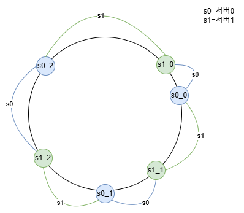

수평적 규모 확장성을 달성하기 위해서는 요청 또는 데이터를 서버에 균등하게 배분하는 것이 중요하다. 안정 해시는 이 목표를 달성하기 위해 보편적으로 사용되는 기술이다.

## 해시 키 재배치(rehash) 문제

N개의 캐시 서버가 있다고 하자. 이 서버들에 부하를 균등하게 나누는 보편적 방법은 해시 함수를 사용하는 것이다.  
serverIndex=hash(key) % N  

총 4대의 서버를 사용한다고하자. 다음 표는 주어진 각각의 키에 대해서 해시 값과 서버 인덱스를 계산한 예제이다. 
| 키 | 해시 | 해시 % 4 (서버인덱스) |
|-------|-------|-------|
| key0  | 42342433 | 1 |
| key1  | 12321432 | 0 |
| key2  | 18014787 | 3 |
| key3  | 78979832 | 0 |
| key4  | 90384553 | 1 |
| key5  | 24402591 | 3 |
| key6  | 82221570 | 2 |
| key7  | 66961810 | 2 |

특정한 키가 보관된 서버를 알아내기 위해, 나머지(modular) 연산을 f(key) % 4 와 같이 적용하였다.  
예를 들어 hash(key0) % 4 = 1 이면, 클라이언트는 캐시에 보관된 데이터를 가져오기 위해 서버 1에 접속하여야 한다.

키 값이 서버에 어떻게 분산되는지 보여준다. 이 방법은 서버 풀(server pool)의 크기가 고정되어있고, 데이터 분포가 균들할 때 잘 동작한다. 하지만 서버가 추가되거나 기존 서버가 삭제되면 문제가 생긴다. 예를 들어 1번 서버가 장애를 일으켜 동작을 중단했다고 하자. 서버 풀의 크기는 3으로 변한다. 그 결과로, 키에 대한 해시 값은 변하지 않지만 나머지(%) 연산을 적용하여 계산한 서버 인덱스 값은달라질 것이다.

| 키 | 해시 | 해시 % 3 (서버인덱스) |
|-------|-------|-------|
| key0  | 42342433 | 1 |
| key1  | 12321432 | 0 |
| key2  | 18014787 | 0 |
| key3  | 78979832 | 2 |
| key4  | 90384553 | 1 |
| key5  | 24402591 | 0 |
| key6  | 82221570 | 0 |
| key7  | 66961810 | 1 |

변화된 키 분포(distribution)을 보자.

장애가 발생한 1번 서버에 보관되어 있는 키 뿐만 아닌 대부분의 키가 재분배 되었다. 1번 서버가 죽으면 대부분 캐시 클라이언트가 데이터가 없는 엉뚱한 서버에 접속하게 된다는 뜻이다. 그 결과로 대규모 캐시 미스(cache miss)가 발생하게 될 것이다. 안정 해시는 이 문제를 효과적으로 해결하는 기술이다.

## 안정 해시

안정 해시(consistent hash)는 해시 테이블 크기가 조정될때 평균적으로 오직 k/n개의 키만 재배치하는 해시 기술이다. 여기서 k는 키의 개수이고 n은 슬롯(slot)의 개수다. 이와는 달리 대부분의 전통적 해시 테이블은 슬롯의 수가 바뀌면 거의 대부분 키를 재배치한다.

### 해시 공간과 해시 링
해시 함수 f로는 SHA-1을 사용한다고 하고, 그 함수의 출력 값 번위는 x0, x1, x2, x3, ... xn과 같다고 하자. SHA-1의 해시 공간(hash space) 범위는 0부터 2¹⁶⁰-1 이며, 나머지 x1부터 xn-1 까지는 그 사이의 값을 갖게 될 것이다. 아래 그림은 이 해시 공간을 표현한 것이다.

이 해시 공간의 양쪽을 구부려 접으면 아래 그림과 같이 해시 링(hash ring)이 만들어진다.

### 해시 서버
이 해시 함수 f를 사용하면 서버 IP나 이름을 이 링 위의 어떤 위치에 대응 시킬 수 있다.  

### 해시 키
사용된 해시 함수는 "해시 키 재배치 문제"에 언급된 함수와는 다르며, 나머지(modular)연산 %는 사용하지 않고 있음에 유의하자.  
캐시할 키 key0, key1, key2, key3 또한 해시 링의 어느 지점에 배치할 수 있다.

### 서버 조회
키의 정보는 해당 키의 위치로 부터 시계 방향으로 링을 탐색해 나가면서 만나는 첫 번째 서버에 저장된다.  
key0은 서버0, key1은 서버1, key2는 서버2,key3은 서버3에 저장된다.  

### 서버 추가
서버를 추가하여도 키 가운데 일부만 재배치하면 된다. 서버4가 추가된 뒤 key0만 재배치됨을알 수 있다.   
key0의 위치에서 시계 방향으로 순회했을 때 처음으로 만나게 되는 서버가 서버4이기 때문이다. 

### 서버 제거
하나의 서버가 제거되면 키 가운데 일부만 재배치된다. 서버1이 삭제되었을 때 key1만이 서버2로 재배치됨을 알 수 있다.

### 기본 구현법의 두 가지 문제
안정 해시 알고리즘은 MIT에서 처음 제안되었다. 기본 절차는 다음과 같다.
- 서버와 키를 균등 분포(uniform distribution) 해시 함수를 사용해 해시 링에 배치한다.
- 키의 위치에서 링을 시계 방향으로 탐색하다 만나는 최초의 서버가 키가 저장될 서버다.
이 접근법에는 두 가지 문제가 있다. 서버가 추가되거나 삭제되는 상황을 감안하면 파티션(partition)의 크기를 균등하게 유지하는게 불가능하다는 것과 파티션은 인접한 서버 사이의 해시 공간이다. 어떤 서버는 굉장히 작은 해시 공간을 할당 받고, 어떤 서버는 굉장히 큰 해시 공간을 할당 받는 상황이 가능하다는 것이다.

서버1이 삭제되는 바람에 서버2의 파티션이 다른 파티션 대비 거의 두 배로 커지는 상황을 보여준다.

서버3은 아무 데이터도 갖지 않는 반면, 대부분의 키는 서버2에 보관된다.  

위 문제를 해결하기 위해 제안된 기법이 가상 노드(virtual node) 또는 복제(replica)라 불리는 기법이다. 

### 가상 노드
가상 노드(virtual node)는 실제 노드 또는 서버를 가리키는 노드로서, 하나의 서버는 링 위에 여러 개의 가상 노드를 가질 수 있다.  

서버0과 서버1은 3개의 가상 노드를 갖는다. 이때 숫자 3은 임의로 정한 것이며, 실제 시스템에서는 그보다 훨씬 큰 값이 사용된다. 서버0을 링에 배치하기 위해 s0 하나만 사용하는 대신 s0_0,s0_1,s0_2의 세 개 가상 노드를 사용했다. 서버1도 동일하다. 따라서 각 서버는 하나가 아닌 여러 개 파티션을 관리해야 한다.  
가상 노드의 개수를 늘리면 키의 분포는 점점 더 균등해진다. 표준 편차(standard deviation)가 작아져서 데이터가 고르게 분포되기 때문이다. 100~200개의 가상 노드를 사용 했을 경우 표준 편차 값은 평균 5%~10% 사이이다. 가상 노드를 많이 늘릴 수록 가상 노드 데이터를 저장할 공간이 더 많이 필요하게 된다. 타협적 결정(tradeoff)가 필요하다.

### 재배치할 키 결정
서버가 추가되거나 제거되면 데이터 일부는 재배치하여야 한다.

서버 4가 추가되었다고 하면 이에 영향 받는 범위는 s4부터  그 반시계 방향에 있는 첫 번째 서버 s3 사이에 있는 키들을 s4로 재배치하여야 한다.

서버 s1이 삭제되면 s1부터 그 반시계 방향에 있는 s0 사이에 있는 키들이 s2로 재배치되어야 한다.
