## 처리율 제한 장치
네트워크 시스템에서 처리율 제한 장치(rate limiter)는 클라이언트 또는 서비스가 보내는 트래픽의 처리율(rate)을 제어하기 위한 장치다.  
HTTP를 예로 들면 이 장치는 특정 기간 내에 전송되는 요청 횟수를 제한한다. API 요청 횟수가 제한 장치에 정의된 임계치(threshold)를 넘어서면 추가로 도달한 모든 호출은 처리가 중단(block) 된다.

- 사용자는 초당 2회 이상 새 글을 올릴 수 없다.
- 같은 IP 주소로는 하루에 10개 이상의 계정을 생성할 수 없다.
- 같은 디바이스로는 주당 5회 이상 리워드(reward)를 요청할 수 없다.

이런 조건을 처리하는 장치가 처리율 제한 장치이다.  

## 처리율 제한 장치를 어디에 둘 것인가?
일반적으로 클라이언트는 처리율 제한을 안정적으로 적용할 곳이 못된다. 클라이언트 요청은 쉽게 위변조가 가능하고, 구현을 통제하는 것도 어려울 수 있다.  

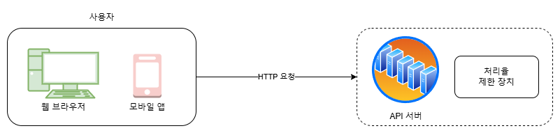

서버측에 제한 장치를 두는 한가지 방법을 보여준다.

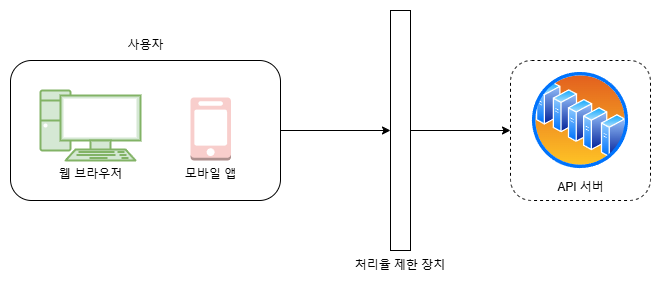

처리율 제한 장치를 API 서버에 두는 대신 처리율 제한 미들웨어(middleware)를 만들어 해당 미들웨어로 하여금 API 서버로 가는 요청을 통제하도록 할 수 있다.  

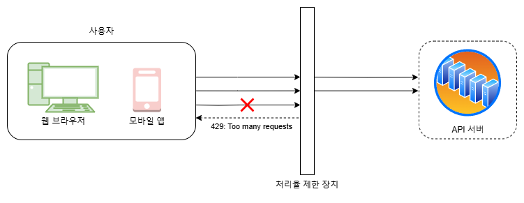

API 서버의 처리율이 초당 2개의 요청으로 제한된 상황에서 클라이언트가 3번째 요청을 앞의 두 요청과 같은 초 범위 내에서 전송하였다고 해 보자.  
앞선 두 요청은 API 서버로 전송될 것이고 세 번째 요청은 처리율 제한 미들웨어에 의해 가로막히고 클라이언트로 HTTP 상태 코드 429가 반환된다.

## 처리율 제한 알고리즘
- 토큰 버킷(token bucket)
- 누출 버킷(leaky bucket)
- 고정 윈도 카운터(fixed window counter)
- 이동 윈도 로그(sliding window log)
- 이동 윈도 카운터(sliding window counter)

### 토큰 버킷 알고리즘
지정된 용량을 갖는 컨테이너다. 이 버킷에는 사전 설정된 양의 토큰이 주기적으로 채워진다. 토큰이 꽉 찬 버킷에는 더 이상의 토큰은 추가되지않는다.

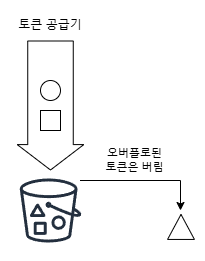

용량이 3인 버킷일때, 토큰 공김기(refiller)는 이 버킷에 매초 2개의 토큰을 추가한다. 버밋이 가득 차면 추가로 공급된 토큰은 버려진다(overflow).  

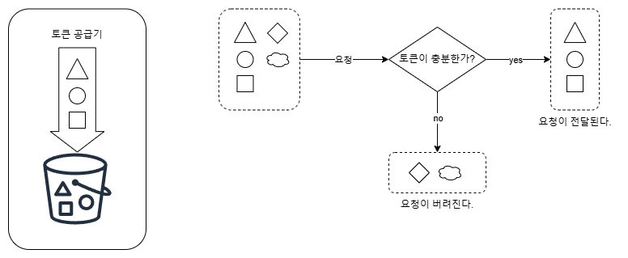

각 요청은 처리될 때마다 하나의 토큰을 사용한다.
- 충분한 토큰이 있는 경우 버킷에서 토큰 하나를 꺼낸 후 요청을 시스템에 전달한다.
- 충분한 토큰이 없는 경우 해당 요청은 버려진다(dropped).

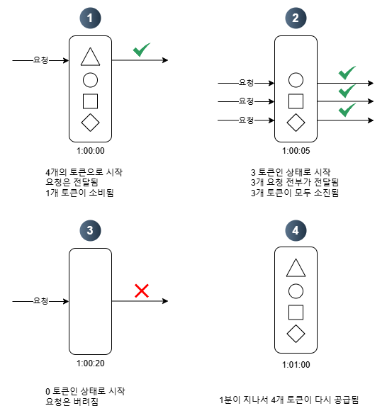

토큰을 어떻게 버킷에서 꺼내고, 토큰 공급기와 처리 제한 로직이 어떻게 동작하는지 보여준다.  
이 예에서 토큰 버킷의 크기는 4이며, 토큰 공급률(refill rate)은 분당 4이다.  

이 토큰 버킷 알고리즘은 2개 인자(parameter)를 받는다.  
- 버킷 크기: 버킷에 담을 수 있는 토큰의 최대 개수
- 토큰 공급률(refill rate): 초당 몇 개의 토큰이 버킷에 공급되는지

통상적으로 API 엔드포인트(endpoint)마다 별도의 버킷을 둔다. 예를 들어 사용자마다 하루에 한 번만 포스팅 할 수 있고 친구는 150명까지 추가 가능하며 좋아요 버튼은 다섯 번까지만 누를 수 있다면 사용자마다 3개의 버킷을 두어야 할 것이다.  

장점
- 구현이 쉽다.
- 메모리 사용 측면에서 효율적이다.
- 짧은 시간에 집중되느 ㄴ트래픽(burst of traffic)도 처리 가능하다. 버킷에 남은 토큰이 있기만 하면 요청은 시스템에 전달된다.

단점
- 버킷 크기와 토큰 공급률이라는 두 개 인자를 적적하게 튜닝하는 것은 까다로운 일이 될 것이다.

### 누출 버킷 알고리즘
누출 버킷(leaky bucket) 알고리즘은 토큰 버킷 알고리즘과 비슷하지만 요청 처리율이 고정되어 있다는 점이 다르다.  
누출 버킷 알고리즘은 보통 FIFO(First-In-First-Out) 큐로 구현한다.

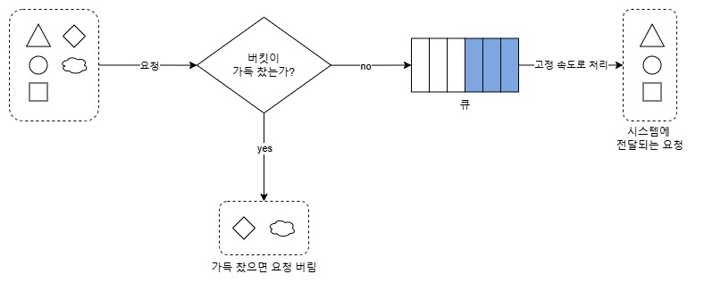

동작 원리
- 요청이 도착하면 큐가 가득 차 있는지 본다. 빈자리가 있는 경우에는 큐에 요청을 추가한다.
- 큐가 가득 차 있는 경우에는 새 요청은 버린다.
- 지정된 시간마다 큐에서 요청을 꺼내어 처리한다.

누출 버킷 알고리즘은 다음 두 인자를 사용한다.
- 버킷 크기: 큐 사이즈와 같은 값이다. 큐에는 처리될 항목들이 보관된다.
- 처리율(outflow rate): 지정된 시간당 몇 개의 항목을 처리할지 지정하는 값이다. 보통 초 단위로 표현된다.

장점
- 큐의 크기가 제한되어 있어 메모리 사용량 측면에서 효율적이다.
- 고정된 처리율을 갖고 있기 때문에 안정적 출력(stable outflow rate)이 필요한 경우에 적합하다.

단점
- 단시간에 많은 트래픽이 몰리는 경우 큐에는 오래된 요청들이 쌓이게 되고, 그 요청들이 제때 처리 못하면 최신 요청들은 버려지게된다.
- 두 개 인자를 올바르게 튜닝하기 까다로울 수 있다.

### 고정 윈도 카운터 알고리즘
고정 윈도 카운터(fixed window counter) 알고리즘은 다음과 같이 동작한다.
- 타임라인(timeline)을 고정된 간격의 윈도(window)로 나누고 각 윈도마다 카운터(counter)를 붙인다.
- 요청이 접수될 때마다 이 카운터의 값은 1씩 증가한다.
- 이 카운터의 값이 사전에 설정된 임계치(threshold)에 도달하면 새로운 요청은 새 윈도가 열릴 때까지 버려진다.

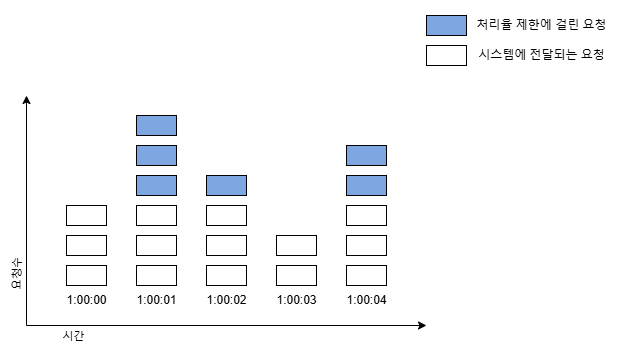

시스템은 초당 3개까지의 요청만을 허용한다. 매초마다 열리는 윈도에 3개 이상의 요청이 오면 초과분은 버려진다.  

이 알고리즘의 가장 큰 문제는 윈도의 경계 부근에 순간적으로 많은 트래픽이 집중될 경우 윈도에 할당된 양보다 더 많은 요청이 처리될 수 있다는 것이다.

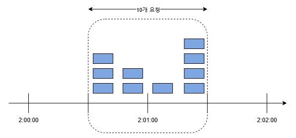

분당 최대 5개의 요청만을 허용하는 시스템의 카운터가 매분마다 초기화된다. 예를 보면 2:00:00 과 2:01:00 사이에 다섯 개의 요청이 들어왔고, 2:01:00 과 2:02:00 사이에 또 다섯 개의 요청이 들어왔다. 윈도 위치를 조금 옮겨 2:00:30 부터 2:01:30까지의 1분 동안을 살펴보면, 이 1분 동안 시스템이 처리한 요청은 10개이다. 허용 한도의 2배인 것이다.

장점
- 메모리 효율이 좋다.
- 이해하기 쉽다.
- 윈도가 닫히는 시점에 카운터를 초기화하는 방식은 특정한 트래픽 패턴을 처리하기에 적합하다.

단점
- 윈도 경계 부근에서 일시적으로 많은 트래픽이 몰려드는 경우 기대했던 시스템의 처리 한도보다 많은 양의 요청을 처리하게 된다.

### 이동 윈도 로깅 알고리즘
고정 윈도 카운터 알고리즘의 문제는 경계 부근에 트래픽이 집중되는 경우 시스템에 설정된 한도보다 많은 요청을 처리하게 된다는 것이다. 이동 로깅 알고리즘은 이 문제를 해결한다.

이동 윈도 로깅 알고리즘 동작원리
- 요청의 타임스탬프(timestamp)를 추적한다. 타임스탬프 데이터는 보통 레디스(Redis)의 정렬 집합(sorted set) 같은 캐시에 보관한다.
- 새 요청이 오면 만료된 타임스탬프는 제거한다. 만료된 타임스탬프는 그 값이 현재 윈도의 시작 시점보다 오래된 타임스탬프를 말한다.
- 새 요청의 타임스탬프를 로그(log)에 추가한다.
- 로그의 크기가 허용치보다 같거나 작으면 요청을 시스템에 전달한다. 그렇지 않은 경우에는 처리를 거부한다.

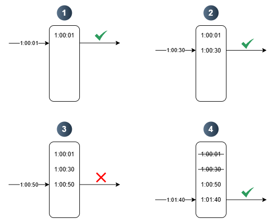

예제의 처리율 제한기는 분당 최대 2회의 요청만을 처리하도록 설정되었다. 보통 로그에 보관되는 값은 리눅스 타임스탬프(Linux timestamp)일 것이지만, 본 예제에서는 사람이 읽기 적함한 표현법을 사용했다.
- 요청이 1:00:01에 도착하였을 때, 로그는 비어 있는 상태다. 따라서 요청은 허용된다.
- 새로운 요청이 1:00:30에 도착한다. 해당 타임스탬프가 로그에 추가 된다. 추가 직후 로그의 크기는 2이며 허용 한도보다 크지 않은 값이다. 따라서 요청은 시스템에 전달된다.
- 새로운 요청이 1:00:50에 도착한다. 해당 타임스탬프가 로그에 추가 된다. 추가 직후 로그의 크기는 3으로 허용 한도보다 큰 값이다. 따라서 타임스탬프는 로그에 남지만 요청은 거부된다.
- 새로운 요청이 1:01:40에 도착한다. (1:00:40, 1:01:40) 범위 안에 있는 요청은1분 윈도 안에 있는 요청이지만, 1:00:40 이전의 타임스탬프는 전부 만료된 값이다. 따라서 두 개의 만료된 타임스탬프 1:00:01과 1:00:30을 로그에서 삭제한다. 삭제 직후 로그의 크기는 2이다 따라서 1:01:40의 신규 요청은 시스템에 전달된다.

장점
- 처리율 제한 메커니즘이 정교하다. 어느 순간의 윈도를 보더라도 허용되는 요청의 개수는 시스템 처리율 한도를 넘지 않는다.

단점
- 다량의 메모리를 사용하는데, 거부된 요청의 타임스탬프도 보관하기 때문이다.

### 이동 윈도 카운터 알고리즘
이동 윈도 카운터(sliding window counter) 알고리즘은 고정 윈도 카운터알고리즘과 이동 로깅 알고리즘을 결합한 것이다. 이 알고리즘을 구현하는 데는 두 가지 접근법이 사용될 수 있다.

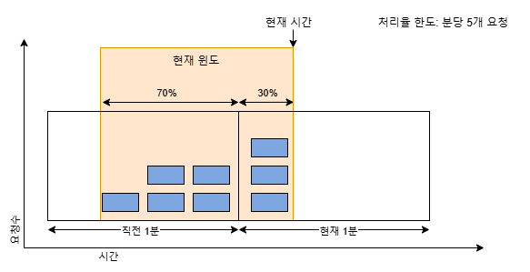

처리율 제한 장치의 한도가 분당 5개 요청으로 설정되어 있다고 하고, 이전 1분 동안 5개의 요청이 그리고 현재 1분 동안 3개의 요청이 왔다고 해 보자. 현재 1분의 30% 시점에 도착한 새 요청의 경우 현재 윈도에 몇 개의 요청이 온 것으로 보고 처리해야할까? 
- 현재 1분간의 요청 수 + 직전 1분간의 요청수 x 이동 윈도와 직전 1분이 겹치는 비율
- 이 공식에 따르면 현재 윈도에 들어 있는 요청은 3+5x70%=5.6개다. 반올림해서 쓸 수도 있고 내림하여 쓸 수도 있는데, 본 예제에서는 내림하여 쓰겠다. 따라서 그 값은 5이다.

본 예제의 경우 처리율 제한 한도가 분당 5개 요청이라고 했으므로 현재 1분의 30% 시점에 도착한 신규 요청은 시스템으로 전달될 것이다. 하지만 그 직후에는 한도에 도달하였으므로 더 이상의 요청은 받을 수 없을 것이다.

장점
- 이전 시간대의 평균 처리율에 따라 현재 윈도의 상태를 계산하므로 짧은 시간에 몰리는 트래픽에도 잘 대응한다.
- 메모리 효율이 좋다

단점
- 직전 시간대에 도착한 요청이 균등하게 분포되어 있다고 가정한 상태에서 추정치를 계산하기 때문에 다소 느슨하다.(40억 개의 요청 가운데 실제로 버려지는 요청은 0.003%에 불과하다.)

### 카운터 보관 장소
처리율 제한 알고리즘의 기본 구조는 단순하다. 얼마나 많은 요청이 접수되었는지를 추적할 수 있는 카운터를 추적 대상별(사용자, IP주소, API 엔드포인트나 서비스단위)로 두고 이 카운터의 값이 어떤 한도를 넘어서면 한도를 넘어 도착한 요청은 거부하는 것이다.  

메모리상에 동작하는캐시가 바람직한데 빠른데다 시간에 기반한 만료 정책을 지원하기 때문이다. 레디스(Redis)는 처리율 제한 장치를 구현할 때 자주 사용되는 메모리 기반 저장장치로서, INCR과 EXPIRE의 두 가지 명령어를 지원한다.
- INCR: 메모리에 저장된 카운터의 값을 1만큼 증가시킨다.
- EXPIRE: 카운터에 타임아웃 값을 설정한다. 설정된 시간이 지나면 카운터는 자동으로 삭제된다.

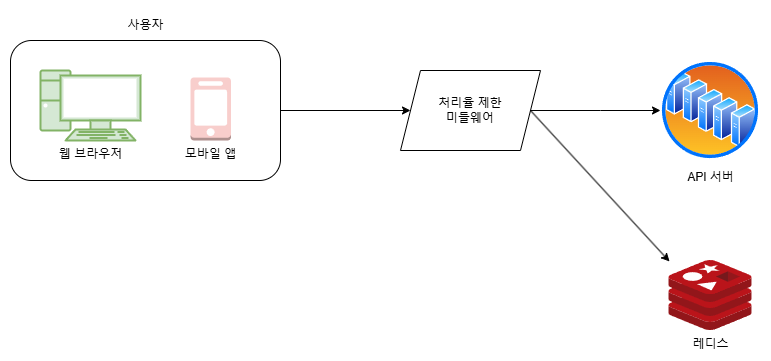

동작원리
- 사용자가 처리율 제한 미들웨어(rate limiting middleware)에게 요청을 보낸다.
- 처리율 제한 미들웨어는 레디스의 지정 버킷에서 카운터를가져와 한도에 도달했는지 아닌지를 검사한다.
  - 한도에 도달했다면 요청은 거부된다.
  - 한도에 도달하지 않았다면 요청은 API 서버로 전달된다. 한편 미들웨어는 카운터의 값을 증가시킨 후 레디스에 저장한다.

## 처리율 제한 규칙
어떤 처리율 제한 규칙이 사용되고 있는지 살펴보자.

```json
{
  "domain": "messaging",
  "descriptors": {
    "key": "message_type",
    "value": "marketing",
    "rate_limit": {
      "unit": "day",
      "requests_per_unit": 5
    }
  }
}
```

위의 예제는 시스템이 처리할 수 있는 마케팅 메시지의 최대치를 하루 5개로 제한하고 있다.

```json
{
  "domain": "auth",
  "descriptors": {
    "key": "auth_type",
    "value": "login",
    "rate_limit": {
      "unit": "minute",
      "requests_per_unit": 5
    }
  }
}
```

위의 예제는 사용자가 분당 5회 이상 로그인 할 수 없도록 제한하고 있다.

이런 규칙들은 보통 설정 파일(configuration file) 형태로 디스크에 저장된다.

### 처리율 한도 초과 트래픽의 처리
어떤 요청이 한도 제한에 걸리면 API는 HTTP 429 응답(too many requests)을 사용자에게 보낸다. 경우에 따라서는 한도 제한에 걸린 메시지를 나중에 처리하기 위해 큐에 보관할 수도 있다. 예를 들어 어떤 주문이 시스템 과부하때문에 한도 제한에 걸렸다고 해 보자. 해당 주문들은 보관했다가 나중에 처리할 수도 있을 것이다.

#### 처리율 제한 장치가 사용하는 HTTP 헤더
사용자는 HTTP 응답 헤더(response header)를 통해 처리율 제한에 걸리고 있음을 감지할 수 있다.
- X-Ratelimit-Remaining: 윈도 내에 남은 처리 가능 요청의 수.
- X-Ratelimit-Limit: 매 윈도마다 클라이언트가 전송할 수 있는 요청의 수.
- X-Ratelimit-Retry-After: 한도 제한에 걸리지 않으려면 몇 초 뒤에 요청을 다시 보내야 하는지 알림.

사용자가 너무 많은 요청을 보내면 429 too many requests 오류를 X-Ratelimit-Retry-After 헤더와 함께 반환하도록 한다.

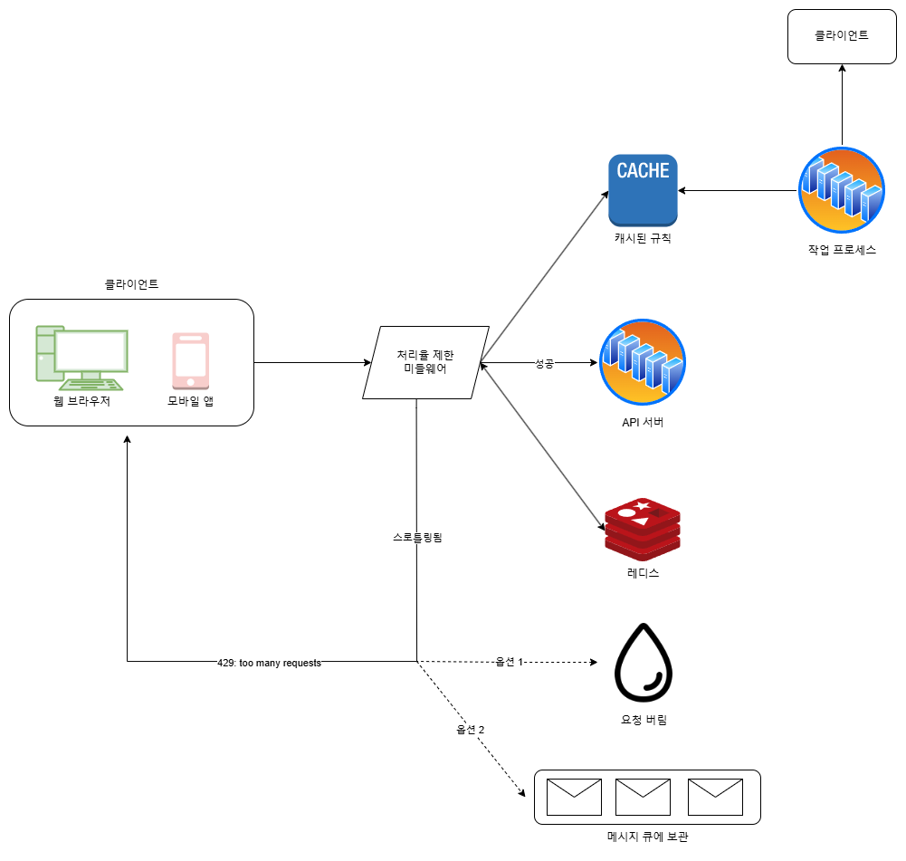

- 처리율 제한 규칙은 디스크에 보관한다. 작업 프로세스(workers)는 수시로 규칙을 디스크에서 읽어 캐시에 저장한다.
- 클라이언트가 요청을 서버에 보내면 요청은 먼저 처리율 제한 미들웨어 도착한다.
- 처리율 제한 미들웨어는 규칙을 캐시에서 가져오고 카운터 및 마지막 요청의 타임스탬프를 레디스 캐시에서 가져온다. 가져온 값들에 근거하여 해당 미들웨어는 요청을 API 서버로 보내거나 429 에러를 클라이언트에 보낸다. 한편 요청을 그대로 버릴 수도 있고 메시지 큐에 보관할 수도 있다.

## 분산 환경에서 처리율 제한 장치 구현
병렬 스레드를 지원하도록 시스템을 확장하기 위해선 두가지 문제를 해결해야 한다. 
- 경쟁 조건(race condition)
- 동기화(synchronization)

### 경쟁 조건
처리율 제한 장치는 대략 다음과 같이 동작한다.
- 레디스에서 카운터의 값을 읽는다.(counter)
- counter + 1 의 값이 임계치를 넘는지 본다.
- 넘지 않는다면 레디스에 보관된 카운터 값을 1만큼 증가시킨다.

병행성이 심한 환경에서는 경쟁 조건 이슈가 발생할 수 있다.

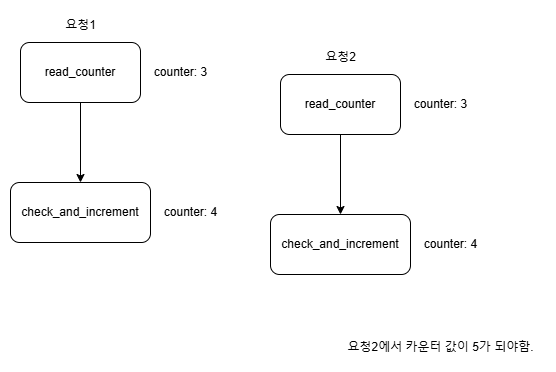

레디스에 저장된 변수 counter의 값이 3일 때, 두 개 요청을 처리하는 스레드(thread)가 각각 병렬로 counter 값을 읽었으며 그 둘 가운데 어느쪽도 아직 변경된 값을 저장하지는 않은 상태라 해 보자. 둘 다 다른 요청의 처리 상태는 상관하지 않고 counter에 1을 더한 값을 레디스에 기록할 것이다. 그리고 counter의 값은 올바르게 변경되었다고 믿을 것이다.  
경쟁 조건 문제를 해결하는 가장 널리 알려진 해결책은 락(lock)이다. 하지만 락은 시스템의 성능을 상당히 떨어뜨린다는 문제가 있다. 위 설계의 경우에 락 대신 쓸 수 있는 해결책이 두 가지 있다. 루아 스크립트(Lua script), 정렬 집합(sorted set) 라고 불리는 레디스 자료구조를 사용하는 것이다. 

### 동기화 이슈
수백만의 사용자를 지원하려면 한 대의 처리율 제한 장치 서버로는 충분하지 않을 수 있다. 그래서 처리율 제한 장치 서버를 여러 대 두게 되면 동기화가 필요해진다.

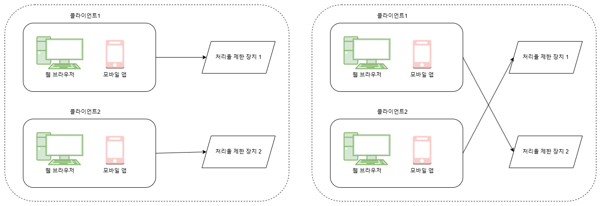

왼쪽의 경우 클라이언트1은 제한 장치 1에 요청을 보내고 클라이언트2는 제한 장치 2에 요청을 보내고 있다. 웹 계층은 무상태(stateless)이므로 클라이언트는 다음 요청을 오른쪽 그림처럼 각기 다른 제한 장치로 보내게 될 수 있다. 이때 동기화를 하지 않는다면 제한 장치 1은 클라이언트 2에 대해서는 아무것도 모르므로 처리율 제한을 올바르게 수행할 수 없을 것이다.  

이에 대한 해결책은 고정 세션(sticky session)을 활용하여 같은 클라이언트로부터의 요청은 항상 같은 처리율 제한 장치로 보낼 수 있도록 하는 것이다.  

더 나은 해결책은 레디스와 같은 중앙 집중형 데이터 저장소를 쓰는 것이다.

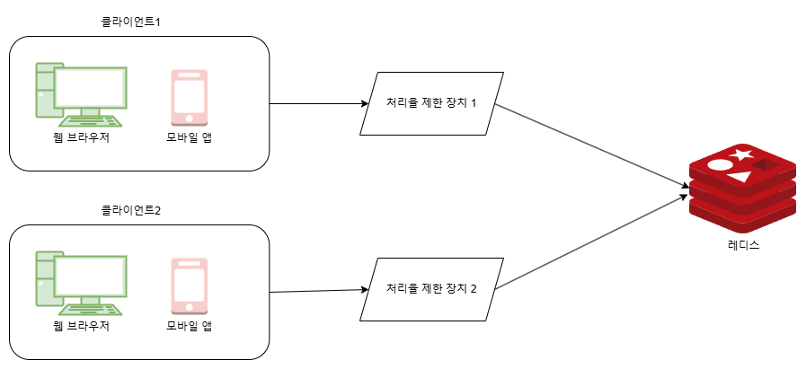

### 성능 최적화
여러 데이터센터를 지원하는 문제는 처리율 제한 장치에 매우 중요한 문제이다. 데이터 센터에서 멀리 떨어진 사용자를 지원하려다보면 지연시간(latency)이 증가할 수밖에 없기 때문이다. 대부분의 클라우드 서비스 사업자는 세계 곳곳에 에지 서버(edge server)를 심어놓고 있다. 사용자의 트래픽을 지역적으로 가장 가까운 에지 서버에 전달하여 지연시간을 줄인다.

### 모니터링
모니터링을 통해 다음 두 가지를 확인할 수 있다.
- 체택된 처리율 제한 알고리즘이 효과적인지
- 정의한 처리율 제한 규칙이 효과적인지

예를 들어 처리율 제한 규칙이 너무 빡빡하게 설정되었다면 많은 유효 요청이 처리되지 못하고 버려질 것이다.  
깜짝 세일같은 이벤트 때문에 트래픽이 급증할 때 처리율 제한 장치가 비효율적으로 동작한다면, 그런 트래픽 패턴을 잘 처리할 수 있도록 알고리즘을 변경하는것이 필요할 수 있다. (그런 상황에는 토큰 버킷이 적합할 것이다.) 
